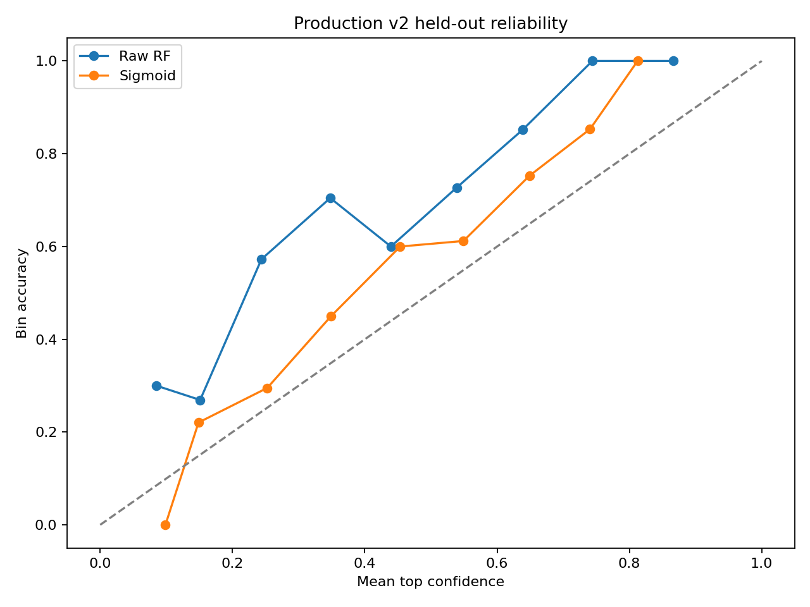
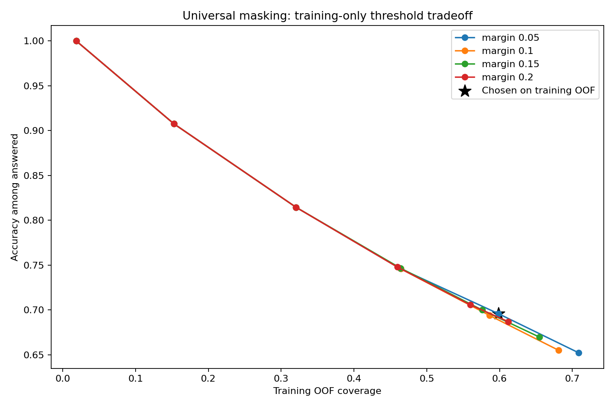

# Resume Screener AI

A locally trained job-category classifier using scikit-learn, FastAPI and React. It demonstrates reproducible training, calibration and uncertainty handling. **This is not a hiring decision tool, a candidate ranking system or a measure of applicant quality.**

**Official model: production_v2.** Experimental candidates are archived and not served.

## Live demo

Public deployment is pending; no live URL is claimed. See [deployment instructions](DEPLOY_HF.md). The API exposes `/health` and interactive documentation at `/docs`.

## Dataset and disclosure

Training uses the public [Sneha Anbhawal Kaggle Resume Dataset](https://www.kaggle.com/datasets/snehaanbhawal/resume-dataset): 2484 source rows and 24 broad categories, with 2481 retained rows after recorded cleaning. No synthetic training data was used. Labels and scraped source content were not independently validated. Public availability is not evidence of consent for every downstream use.

The seed-42 stratified split remains 1984 training and 497 held-out rows in [reports/split.json](reports/split.json). [Provenance](data/provenance.json) records sources and hashes. `data/resumes.csv` is the training source. **`data/resumes_tech.csv` is rejected audit material, NOT training data**; it remains in the repository for reproducibility. Its publisher states CC0. Do not upload or commit private resumes.

## Methodology and honesty findings

The initial benchmark contained a label-name shortcut: the earlier error analysis found own-label variants in 2199/2484 resumes (share 0.8852657004830918). Baseline v1's recorded test macro F1 was 0.7783811932565733. That internal score allowed job-title lookup and was not convincing evidence of generalization. Label presence alone does not measure how much of a prediction is caused by the shortcut.

The L1 diagnostic removed each resume's own category variants during fitting and evaluation, recording test macro F1 0.5580907457690872. It measured sensitivity to label wording, but required the true category and therefore could not serve as an inference pipeline. It also removed genuine domain evidence; the difference is not a causal decomposition of performance.

Production_v2 applies the entire fixed category-variant dictionary, including canonical lemma forms, to every input without knowing its label. The same transformation runs during training and inference. TF-IDF plus Random Forest, sigmoid calibration and a training-selected abstention policy remain the official model. Its recorded test macro F1 is 0.520205602976937. Promotion addressed the known shortcut; it did not improve the old headline score or prove that every remaining shortcut was eliminated.

The later classical-ML exploration evaluated seven configurations, including a freshly measured control, technical-token preservation, balanced weights, Logistic Regression, word/character SVMs and combined features. Word SVC ranked first on raw training CV at 0.5187029137588132 ± 0.02127154152059278; its calibrated test macro F1 was 0.5178233530804878. The combined word/character candidate recorded 0.5191586134385697. Only the frozen finalists received final test evaluation. These results did not demonstrate a meaningful held-out improvement over production_v2. Training CV did improve over the freshly measured raw RF control, so it would be inaccurate to say all CV differences were noise. Raw ranking CV and calibrated production CV are different measurements; fold standard deviation is not a significance test. No exploration candidate was adopted. See the [complete ranked exploration](experiments/exploration/SUMMARY.md).

Jillani's technical-role dataset was then audited and rejected for training as-is: 962 rows contained only 166 unique texts, with 796 redundant exact duplicates (fraction 0.8274428274428275). Python Developer has 6 unique texts, DevOps Engineer 7 and Java Developer 13, as recorded in the audit category table. Own-label variants occur in 880/962 rows; 734 rows carry heuristic encoding-corruption markers. After exact deduplication, no unique text had a same-category cosine neighbor above 0.9 under the declared audit representation: repeated copies, rather than additional detected near-duplicates, dominate this problem. The CSV is retained solely to reproduce the [audit](reports/tech_dataset_audit/SUMMARY.md), not used in training.

All selection used the saved training partition. Held-out results are reporting evidence, not a basis for further tuning. The existing split has nevertheless been inspected across historical experiments and is not an untouched external benchmark.

## Final pipeline and results

Lowercase text, remove URLs/nonletters, remove NLTK stopwords, noun-lemmatize, and universally mask label variants and their lemma forms. Fit TF-IDF (`max_features=5000`, `ngram_range=(1, 2)`) within each training fold. The saved vectorizer calls `clean_text_universal`; the historical legacy cleaner is retained only for archived artifact compatibility.

Random Forest and sigmoid calibration are fixed from the recorded protocol. Nested training CV keeps calibration separate from fitting; vocabulary/IDF are fold-local. The final forest is fitted only on training rows. See [protocol](experiments/production_v2/protocol.json) and [results](experiments/production_v2/results.json). No metrics were recomputed for this wrap-up.

| Metric | Recorded value |
|---|---|
| Calibrated CV macro F1 | 0.4861169105304429 ± 0.014420560374723257 |
| Test macro F1 | 0.520205602976937 |
| Test accuracy | 0.5633802816901409 |
| Test abstention coverage | 0.6156941649899397 |
| Test answered accuracy | 0.7189542483660131 |

These test scores describe calibrated predictions on all held-out rows before abstention. CV spread is fold standard deviation, not a confidence interval. The per-class results show substantial variation:

<details><summary>Recorded per-class test F1</summary>

| Category | Test F1 |
|---|---|
| ACCOUNTANT | 0.631578947368421 |
| ADVOCATE | 0.37735849056603776 |
| AGRICULTURE | 0.43478260869565216 |
| APPAREL | 0.3333333333333333 |
| ARTS | 0.35294117647058826 |
| AUTOMOBILE | 0.25 |
| AVIATION | 0.7727272727272727 |
| BANKING | 0.6341463414634146 |
| BPO | 0.0 |
| BUSINESS-DEVELOPMENT | 0.5517241379310345 |
| CHEF | 0.7727272727272727 |
| CONSTRUCTION | 0.6956521739130435 |
| CONSULTANT | 0.05405405405405406 |
| DESIGNER | 0.5789473684210527 |
| DIGITAL-MEDIA | 0.6486486486486487 |
| ENGINEERING | 0.6363636363636364 |
| FINANCE | 0.5333333333333333 |
| FITNESS | 0.6666666666666666 |
| HEALTHCARE | 0.41509433962264153 |
| HR | 0.8163265306122449 |
| INFORMATION-TECHNOLOGY | 0.7142857142857143 |
| PUBLIC-RELATIONS | 0.5833333333333334 |
| SALES | 0.44 |
| TEACHER | 0.5909090909090909 |

</details>

## Calibration and uncertainty

| Test metric | Raw | Sigmoid calibrated |
|---|---|---|
| brier_score | 0.6901419517102615 | 0.6029392062638212 |
| log_loss | 1.969160540109228 | 1.6418886069471392 |
| ece_10_bins | 0.23144869215291752 | 0.09569966890724542 |

Brier is the mean sum of squared class-probability errors; log loss uses natural logarithms. ECE uses top-label confidence with ten equal-width bins and depends on binning. Calibration is not a correctness guarantee.

The policy flags uncertainty when calibrated top probability is below **0.4**, the top-two margin is below **0.05**, or input has fewer than **50** whitespace words. Threshold selection used training out-of-fold utility (correct +1, wrong -1, abstain 0), with coverage/lower-threshold tie-breaks. This is a demo cost assumption, not an operationally validated policy. On test, it answers 306/497 rows. Selective accuracy must not be confused with all-row accuracy.




## Run locally

Use the pinned Python dependencies; the recorded training environment used Python 3.12.14. From the project root:

```powershell
python -m venv .venv
.\.venv\Scripts\python.exe -m pip install -r requirements.txt
.\.venv\Scripts\python.exe -m nltk.downloader stopwords wordnet omw-1.4
.\.venv\Scripts\python.exe -m uvicorn api.main:app --host 127.0.0.1 --port 8000
```

In another terminal:

```powershell
cd frontend
npm install
npm run dev
```

Open http://127.0.0.1:5173. The frontend targets http://127.0.0.1:8000 by default; use `VITE_API_BASE_URL` to override it. See [frontend setup](frontend/README.md) for Node requirements. On Unix, use `.venv/bin/python` for the Python commands. Included model artifacts serve without model downloads; NLTK downloads are explicit setup steps. Git LFS is required to retrieve the stored model/data files when cloning (`git lfs pull`).

## API and privacy

`GET /health` reports readiness. `POST /predict` accepts a JSON object with a string `text` field. `POST /predict/file` accepts multipart field `file` for PDF, DOCX or TXT. Create `request.json` locally, then:

```powershell
curl.exe -X POST http://127.0.0.1:8000/predict -H "Content-Type: application/json" --data-binary @request.json
curl.exe -X POST http://127.0.0.1:8000/predict/file -F "file=@cv.pdf"
```

An existing response captured from production_v2 using an authored demo (not a held-out resume) is preserved in [api_examples.json](experiments/production_v2/api_examples.json). No new prediction was run for this document.

Legacy `predicted_category`, `confidence`, and `top_predictions` describe raw forest probabilities. `calibrated_predicted_category`, `calibrated_confidence`, and `calibrated_top_predictions` provide the calibrated view. `is_uncertain` and `uncertainty_reason` make uncertainty explicit; the UI shows possible categories when uncertain. No field scores candidate quality.

`top_terms` multiplies present TF-IDF features by global forest feature importance. These are influential terms, not causal or class-specific explanations. Uploads use bounded in-memory processing, signature validation and friendly errors. Files are not permanently stored and resume contents are not logged. File responses include an extracted-text preview for the requesting browser. Scanned/image-only and encrypted PDFs are unsupported; no OCR is performed.

## Verification and evidence

Run `.\.venv\Scripts\python.exe -m pytest -v` and `npm test` inside `frontend`. Final wrap-up reports are in [reports/production_v2_final](reports/production_v2_final). Artifact checksum verification matches [models/manifest.json](models/manifest.json) against the archived production_v2 artifacts.

The evidence trail retains [baseline_v1](experiments/baseline_v1), [L1](experiments/leakage_impact), [production_v2](experiments/production_v2), [exploration](experiments/exploration), and the [technical dataset audit](reports/tech_dataset_audit). The [experiment log](experiments/experiment_log.md) records the closing decision. `src/finalize_documentation.py` generated this final document from saved results; its one-time guard prevents accidental overwrite. Earlier report generators produce historical documents and should not overwrite this final README.

## Deployment

The Docker SDK setup uses `PORT` with a default of 7860 and binds to `0.0.0.0`, running as a non-root user. NLTK resources are installed during the image build and model artifacts are included. See [DEPLOY_HF.md](DEPLOY_HF.md) and [README_HF.md](README_HF.md). An actual Docker build/public deployment has not been verified locally. Restrict the currently permissive CORS configuration to the real frontend origin before production deployment.

## Limitations

- The observed classical TF-IDF experiments remain around the production test macro F1 of 0.520205602976937; this is an empirical plateau in the investigated settings, not a proven upper bound. Broad occupational categories cannot finely resolve Java, Python or DevOps roles.
- Universal masking removes useful occupational vocabulary too. Related skill words, templates and source bias may remain. Alphabetic cleaning loses distinctions such as C++ and C#.
- The rejected technical dataset has extensive exact duplication, minimal independent support per role, frequent label mentions and encoding-warning markers. Retaining it for an audit does not make it suitable training data.
- Small, imbalanced, single-source English data limits per-class reliability and calibration. Non-English, short and out-of-domain CVs are unreliable; thresholds are dataset-specific. The repeatedly inspected historical holdout is not an independent external validation set.
- There is no production monitoring, fairness or hiring-outcome validation, authentication, rate limiting or deployment load test. This remains a classification demonstration, not a hiring tool.
- Load only trusted joblib artifacts. Checksums detect mismatches, not malicious replacement of both model and manifest. Restart the API after intentional artifact updates.

## What I'd improve with more time

Obtain a properly sourced, consented and independently labeled technical-role dataset; audit duplication, taxonomy and source separation before defining a new split. Compare pretrained embeddings under training-only selection with explicit download approval, measured resource costs and honest explanation limits; embeddings have not yet been evaluated. Investigate per-class uncertainty thresholds using training-only validation and enough independent examples, followed by external calibration validation. Add privacy-aware monitoring and deployment load tests.
