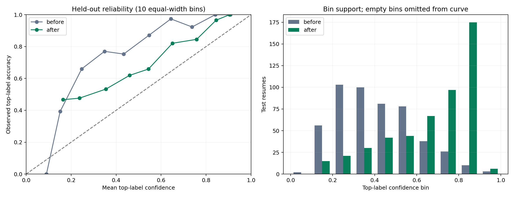
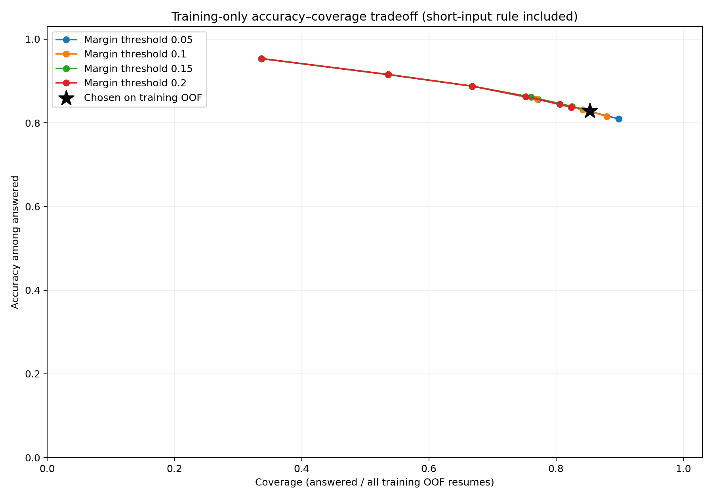

## Calibration and abstention

The original Random Forest and TF-IDF artifacts are unchanged. A separate **sigmoid** calibration mapping adjusts their probabilities. The original dataset and saved seed-42 split are preserved. All tables in this section are generated from `results.json`, not entered manually.

**Training-only selection:** nested stratified five-fold CV. Every outer validation row is excluded from both classifier fitting and calibration fitting. Within each outer fitting partition, an inner five-fold loop refits TF-IDF and Random Forest and supplies OOF probabilities for calibrator fitting. The same raw probability bank is used for sigmoid and isotonic. `CalibratedClassifierCV` with a frozen identity response adapter performs sklearn's class-wise mapping and renormalization; the adapter learns nothing and the actual CV work is explicit in `src/calibrate.py`. No model sees its calibration labels during base-model fitting.

Pooled outer-OOF comparison (all training rows):

| Method | Log loss | Multiclass Brier | Top-label ECE |
|---|---|---|---|
| raw | 1.3376296188292593 | 0.5244030493951612 | 0.34343497983870963 |
| sigmoid | 0.9323363606992807 | 0.36079398792311707 | 0.10090908479632467 |
| isotonic | 1.234797388377875 | 0.36644195344168123 | 0.05127083494240399 |

The predeclared primary criterion was lower log loss, with Brier as a tie-breaker. Eligible methods had to improve both proper scores over raw and lose no more than 0.01 in training OOF accuracy or macro F1. Sigmoid wins on log loss and Brier. **Isotonic has lower training ECE**, but ECE was not the selection criterion; its more flexible mapping can overfit sparse classes and produce extreme probabilities. This risk is documented in the [scikit-learn calibration API](https://scikit-learn.org/1.6/modules/generated/sklearn.calibration.CalibratedClassifierCV.html). No test score was used to choose between methods.

The final mapping is fitted to the raw five-fold OOF predictions from the entire training partition and applied to the unchanged full-training Random Forest. This follows non-ensemble cross-validated calibration semantics. [Frozen protocol](../../../experiments/calibration_v1/20260928T1302135841413Z/protocol.json), [folds](../../../experiments/calibration_v1/20260928T1302135841413Z/folds.json), [selection saved before test evaluation](../../../experiments/calibration_v1/20260928T1302135841413Z/selection.json).

**Once-only held-out evaluation:**

| Metric | Before | After | After minus before |
|---|---|---|---|
| ece_10_bins | 0.3398490945674045 | 0.13737276107430005 | -0.20247633349310443 |
| brier_score | 0.5105040241448693 | 0.33200305498864047 | -0.17850096915622882 |
| log_loss | 1.260991247413868 | 0.8657006434773424 | -0.3952906039365256 |
| accuracy | 0.744466800804829 | 0.8048289738430584 | 0.06036217303822944 |
| macro_f1 | 0.6803518093463513 | 0.7783811932565733 | 0.09802938391022198 |

Multiclass Brier is the mean **sum across classes** of squared probability errors (range 0–2), not divided by class count. Log loss uses natural logarithms and sklearn's machine-epsilon clipping for zeros. ECE uses the top predicted class, ten equal-width confidence bins, and the count-weighted absolute difference between bin accuracy and mean confidence; the final bin includes probability one. Empty bins contribute zero. ECE is bin-sensitive and is not a proper scoring rule.

Neither accuracy nor macro F1 degraded, including against the predeclared absolute tolerance of 0.01. The class-specific mappings can reorder winners: 60 test predictions changed, including 38 wrong-to-correct, 8 correct-to-wrong, and 14 changes that remained wrong. The [audit](../../../experiments/calibration_v1/20260928T1302135841413Z/calibration_audit.json) verifies class ordering, nested fold isolation and unchanged base artifacts using saved predictions, without another held-out inference run. The gain is not uniform across examples and does not remove source/title shortcuts identified in the earlier error analysis. Calibration remains imperfect; the measured ECE is not zero.

**Abstention:** `T1=0.3`, `T2=0.15`. Mark uncertain when calibrated top probability is below T1 **or** the calibrated top-two margin is below T2. Fewer than 50 whitespace words also triggers uncertainty. Comparisons are strict `<`; a value equal to a threshold passes that rule. Reason precedence is `short_input`, then `low_confidence`, then `small_margin`.

Thresholds were selected from a coarse, predeclared grid plus a no-numerical-abstention reference. Utility is **+1 for a correct answer, -1 for a wrong answer, 0 for abstention**, averaged over all training OOF rows. Ties favor greater coverage, then lower T1, then lower T2. This is a transparent demo cost assumption, not a validated business cost or a target accuracy. The chosen training utility is 0.5609879032258065; selected training coverage is 0.8533266129032258 and answered accuracy is 0.828706438275251. These are tuning scores and may be optimistic after selection. [All grid candidates](../../../experiments/calibration_v1/20260928T1302135841413Z/threshold_grid.csv).

On the held-out set, **427/497 resumes were answered**, coverage **0.8591549295774648**. Accuracy among answered resumes is **0.8548009367681498** (365 correct, 62 wrong). Coverage describes this evaluation distribution, not how often an arbitrary real-world CV will be answered.

**API compatibility:** `predicted_category`, `confidence` and `top_predictions` retain their original **uncalibrated** meanings. New clients use `calibrated_predicted_category`, `calibrated_confidence` and `calibrated_top_predictions` together: multiclass calibration can change the winning category. Both `/predict` and `/predict/file` also return `is_uncertain` and `uncertainty_reason` (`low_confidence`, `small_margin`, `short_input` or null). Both candidate lists are retained when uncertain; the top three probabilities are not rescaled. A false uncertainty flag only means no policy trigger, not guaranteed correctness. Influential terms still describe the original forest's global feature salience, not the calibration mapping or a causal explanation. [Real API responses](../../../experiments/calibration_v1/20260928T1302135841413Z/api_examples.json) use authored demo inputs, not held-out records; input contents are not logged.

The frontend shows a neutral **“The model isn't confident about this CV”** banner and **“Possible categories”** when uncertain. Otherwise it shows the calibrated winner. Probability bars use calibrated values, with a keyboard-focusable explanation of calibration and its limits. Display percentages are truncated to one decimal place; API values retain their original precision. The ethical footer remains unchanged: this is not a hiring decision tool.

**Limitations:** small, imbalanced, single-source English data; few calibration positives for minority classes; a distribution difference between fold-trained forests and the full-training forest; residual calibration error and dataset-specific thresholds. Calibration does not guarantee correctness, candidate quality, fairness or reliable out-of-domain detection. Short or non-English inputs remain problematic. The holdout was previously inspected for baseline error analysis, so it is not a pristine unseen external benchmark; no calibration or threshold decisions used its scores. No external data, heavy dependency, model retraining policy or production monitoring was added.

**Reproduction:** `python -m src.calibrate --run-dir <new-run-directory>` requires a `before/` archive matching the current raw artifacts, results and split. It saves training-only choices before evaluating the test set and refuses a run directory that already has held-out results. Use saved `test_probabilities.npz` and `test_results.json` for subsequent analysis rather than rerunning inference to choose settings. `python -m src.calibration_report --run-dir experiments/calibration_v1/20260928T1302135841413Z` regenerates documentation and counts without model selection. Older files are archived before replacement. Restart FastAPI after artifact updates; missing or corrupt calibration artifacts fail readiness instead of silently claiming calibrated scores.
