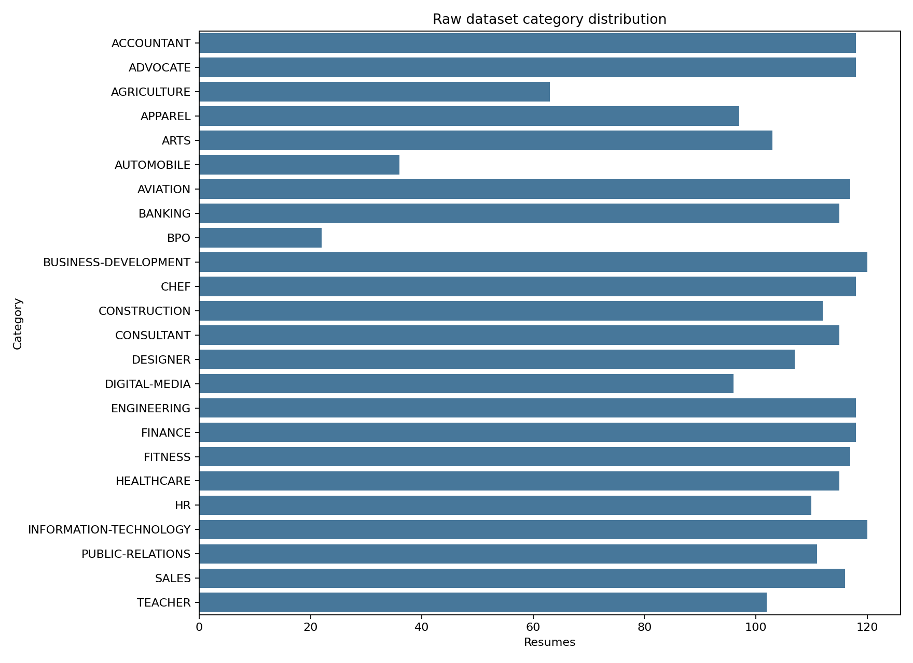
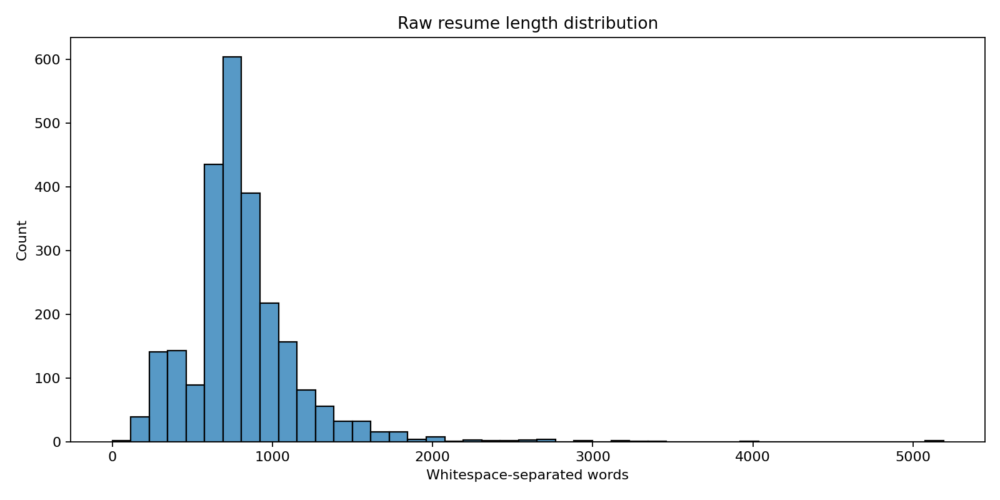
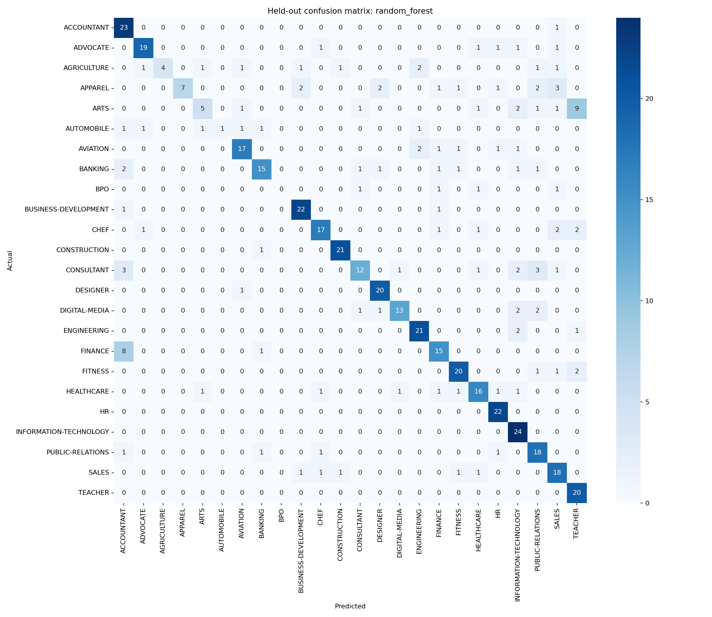

# Resume Screener AI

## Live Demo

**Hugging Face Spaces API URL:** _Pending deployment — replace with the public `.hf.space` URL after the build succeeds._

Use `<public-api-url>/health` for readiness and `<public-api-url>/docs` for the interactive API. Deployment instructions: [DEPLOY_HF.md](DEPLOY_HF.md).

The YAML metadata above is required by Spaces; `README_HF.md` contains the same metadata and a short summary. If `src.readme` regenerates this document, restore the metadata and this deployment section before pushing to Spaces.

A locally trained resume **job-category classifier** with a FastAPI REST service. It demonstrates an auditable ML workflow for a junior engineering portfolio: source provenance, duplicate handling, leakage-safe model comparison, persisted artifacts, and tested inference. It organizes resume text; it does not assess candidate merit, rank people, or automate hiring decisions.

## Dataset and disclosure

Real public [Kaggle Resume Dataset](https://www.kaggle.com/datasets/snehaanbhawal/resume-dataset) by Snehaan Bhawal, downloaded directly from Kaggle. **No synthetic training data was used.** The first attempted `gauravduttakiit/resume-dataset` endpoint returned HTTP Forbidden; the successful dataset uses broader occupational labels rather than the narrower developer categories in that variant.

The archive contains website-derived resume examples associated with LiveCareer. Source schema `Resume_str` is renamed to `Resume`; only `Resume` and `Category` are retained in `data/resumes.csv`. Raw size: **2484 resumes, 24 categories**. These are source-provided labels, not independently verified annotations. See `data/provenance.json` for URLs, archive member and hashes. CSV SHA-256: `76275a0d8e029e4fb46250296c0a25661bd44534ccdec034f4a19f42bbc753a0`.

The dataset may contain personal information. Public availability does not imply consent for unrelated reuse; avoid logging resume bodies, review upstream terms before redistribution, and do not commit private resumes. The project makes no independent licensing or anonymization guarantee about source records.

## EDA

The executed [notebook](notebooks/eda.ipynb) and `src/eda.py` produce category counts, whitespace word-length statistics, and frequent cleaned terms per category. Raw mean word length is **811.3256843800322**; median is **757.0**. Counts and terms are recorded in `results.json` under `eda`.





[Frequent terms by category](reports/figures/frequent_terms.png)

## Methodology and leakage controls

- Normalize case, remove URLs and nonalphabetic characters, tokenize, remove NLTK English stopwords, and noun-lemmatize with WordNet. This deterministic function is reused by the saved vectorizer at inference.
- Remove 1 empty cleaned rows, 0 rows from 0 conflicting-label text groups, and 2 additional identical cleaned-text rows. This leaves **2481 unique cleaned resumes**. Exact cleaned duplicates cannot cross the split. Near-duplicate templates and shared source authors are not resolved.
- Stratified train/test split: test fraction **0.2**, seed **42**, yielding **1984 training** and **497 test** rows. Original CSV indices are saved in `reports/split.json`; category support is in `results.json`.
- TF-IDF: `max_features=5000`, `ngram_range=(1, 2)`. It is fitted inside a scikit-learn Pipeline in each of **5 shuffled stratified folds**, preventing vocabulary/IDF leakage. Corpus-wide EDA does not set the vocabulary.
- Compare Logistic Regression, Multinomial Naive Bayes and Random Forest using mean training-fold macro F1. Fixed baseline hyperparameters live in `src/train.py`; there is no hidden search or test-set tuning. Macro F1 weights minority categories equally.
- Freeze model selection before held-out evaluation. Fit each model on the training partition, then evaluate all on the same test partition. Persist only the winner and its paired vectorizer. Do not refit on the test set, so the saved artifact reproduces the reported held-out score.

## Actual results

Values below are unrounded decimal values read directly from `results.json`. CV standard deviation describes fold variation, not a confidence interval. Held-out scores describe this split only.

| Model | CV macro F1 mean | CV std | Test accuracy | Test macro precision | Test macro recall | Test macro F1 |
|---|---|---|---|---|---|---|
| logistic_regression | 0.5855704909268196 | 0.017598258927527533 | 0.6559356136820925 | 0.6264313990378281 | 0.6052360389102379 | 0.5938016144793187 |
| multinomial_nb | 0.47450642359117845 | 0.0175509692150161 | 0.5593561368209256 | 0.5871868168984041 | 0.508960633982087 | 0.4790738245991917 |
| random_forest | 0.6577281212720567 | 0.01833295124954121 | 0.744466800804829 | 0.7501370095253156 | 0.6902509239108209 | 0.6803518093463513 |

**Selected: `random_forest`.** Random Forest achieved the best observed CV macro F1. It can capture nonlinear feature interactions, but trees are harder to interpret as class-specific term evidence and cost more than a sparse linear model. The measured CV advantage is the reason to accept that complexity here, not evidence that forests are universally superior for text. Naive Bayes provides a cheap, inspectable baseline but assumes conditional independence. Logistic Regression offers direct class-term weights. Random Forest provides nonlinear interactions at greater complexity. These tradeoffs are considered alongside the predeclared CV selection rule; the test scores do not choose the winner. No statistical significance claim is made about the ordering.

Measured wall-clock training costs on the environment recorded in `results.json` (not serving latency benchmarks):

| Model | CV seconds | Full training-partition fit seconds |
|---|---|---|
| logistic_regression | 29.88189439999951 | 6.583724199999779 |
| multinomial_nb | 26.397509500000524 | 5.555089600000429 |
| random_forest | 39.563955100000385 | 8.920034500000838 |



All model confusion matrices are saved under `reports/figures/`; raw matrices and ordered class labels are in `results.json`.

## Run locally

Tested Python version: `3.12.14`. Run from the project root. `requirements.txt` pins the actual tested environment, including transitive dependencies. Install Python, then:

```bash
python -m venv .venv
# Windows PowerShell:
.venv\Scripts\Activate.ps1
# macOS/Linux instead: source .venv/bin/activate
python -m pip install -r requirements.txt
python -m nltk.downloader stopwords wordnet omw-1.4
python -m uvicorn api.main:app --host 127.0.0.1 --port 8000
```

The included dataset and trained artifacts let you serve without retraining. NLTK corpus downloads are explicit setup steps; inference does not access the network. Interactive API documentation: `http://127.0.0.1:8000/docs`. `GET /health` returns model readiness; unavailable artifacts or corpora produce HTTP service unavailable.

Reproduce the complete workflow (the data download is optional when using the included CSV):

```bash
python -m src.data
python -m src.eda
python -m src.train
python -m src.notebook
python -m src.verify
python -m src.readme
```

`src.data` reuses `data/source.zip` if present; otherwise it downloads the current upstream archive. Compare the resulting hash with the included provenance before treating a rerun as the same dataset. Upstream changes can change results. Training overwrites model artifacts and results; verification and README generation should follow it. Timing varies by hardware, and numeric libraries can introduce platform-dependent floating point differences. NLTK corpus contents are external dependencies and are not package-pinned.

## API contract and real example

```bash
curl -X POST http://127.0.0.1:8000/predict -H "Content-Type: application/json" -d '{"text": "Accountant managing audits, financial statements and tax reporting"}'
```

On Windows use `curl.exe` if `curl` is a PowerShell alias. Actual response from the saved model, captured by `src.verify` in `results.json`:

```json
{
  "predicted_category": "ACCOUNTANT",
  "confidence": 0.365,
  "top_predictions": [
    {
      "category": "ACCOUNTANT",
      "probability": 0.365
    },
    {
      "category": "FINANCE",
      "probability": 0.16
    },
    {
      "category": "BANKING",
      "probability": 0.085
    }
  ],
  "top_terms": [
    "accountant",
    "financial",
    "financial statement",
    "statement",
    "reporting",
    "audit",
    "managing",
    "tax"
  ],
  "text_stats": {
    "word_count": 8,
    "short_input": true
  },
  "source": "text",
  "text_preview": null
}
```

`confidence` is the winning class's **uncalibrated** `predict_proba` value. It is not a validated likelihood of correctness or a candidate suitability score. The API rejects missing/empty/whitespace text, non-string values, oversized text, unknown fields and inputs with no vocabulary overlap. Weakly related inputs with some known words can still receive a label; no general out-of-domain detector is claimed. Artifacts load once at startup; synchronous inference runs through FastAPI's thread pool. Missing or mismatched artifacts produce an unavailable response, and unexpected prediction failures return a generic server error without exposing internals. `MODEL_DIR` optionally selects another trusted artifact directory.

## CV uploads and richer predictions

Start the frontend with `cd frontend`, `npm install`, then `npm run dev`; open http://127.0.0.1:5173. Select **Upload CV** to browse/drop a PDF, DOCX or TXT, or **Paste text** to use the original input and examples. **Clear / start over** resets both inputs and the result.

```bash
curl -X POST http://127.0.0.1:8000/predict/file -F "file=@cv.pdf"
```

Use `curl.exe` on PowerShell. The multipart field is `file`. Both endpoints return the schema in the real example above. File responses set `source` to `"file"` and `text_preview` to the first 500 extracted characters; text responses use `"text"` and `null`.

- `top_predictions` contains the three highest model probabilities, without renormalizing them to sum to one. They are **model confidence (uncalibrated)**, not suitability scores.
- `top_terms` ranks up to eight present features by **input TF-IDF weight multiplied by global Random Forest feature importance**. These can be lemmatized words or bigrams. This is class-agnostic salience, not signed evidence for the winning class or a causal explanation.
- `text_stats` includes whitespace word count and `short_input`, true below 50 words. This threshold is a heuristic, not a validated reliability boundary.
- Uploads are processed in memory without temporary-file spooling or permanent storage. Application errors do not log resume content. The preview deliberately returns a short excerpt to the requesting browser.

The server enforces a 5 MiB (5,242,880-byte) file limit while reading multipart chunks and separately bounds multipart overhead. It checks extensions and content: PDF must start with `%PDF` and parse, DOCX must be a valid ZIP containing `word/document.xml`, and TXT must decode and pass binary-content checks. TXT supports UTF-8, BOM-marked UTF-16 and a Windows-1252 fallback. This cannot prove arbitrary text is a resume.

Additional bounds reject PDFs over 100 pages, DOCX archives over 500 entries or 20 MiB of declared expanded content, and extracted text over 50,000 characters. PDF decompression is bounded. These checks do not replace process isolation, gateway limits, timeouts or load testing for public deployment.

Errors include 400 for malformed multipart, 413 for size limits, 415 for unsupported extensions/signatures, and 422 for invalid or unreadable documents. Empty/image-only documents return `"No readable text found. Scanned/image PDFs are not supported."` Encrypted PDFs are rejected. No OCR is performed. DOCX extraction covers body paragraphs and tables, not every header, footer or text box.

All 35 original tests remain unchanged; 28 upload tests bring the backend total to 63. New coverage includes valid PDF/DOCX/TXT, invalid signatures, oversized streams, empty and image-only documents, encodings and in-memory processing. The frontend's 26 tests and production build pass. Linux/Python 3.12 dependency resolution succeeds with the pinned extraction packages; an actual Docker build remains unverified because Docker is unavailable locally.

## Verification and repository map

Recorded pytest outcome: **63 tests, 0 failures, 0 errors, 0 skipped**. `reports/pytest.xml` contains the actual test run. Coverage includes preprocessing edge cases, artifact integrity, prediction/probability consistency, exact cleaned train/test disjointness, reproduction of the held-out score from saved artifacts, API validation, readiness failures and generic internal-error handling. Run `python -m src.verify` to refresh evidence, or `python -m pytest -q` for tests alone.

| Path | Purpose |
|---|---|
| `data/resumes.csv`, `data/provenance.json` | Original text/label projection and source audit |
| `src/preprocess.py` | Shared NLTK normalization |
| `src/train.py`, `src/evaluate.py` | Fold-local features, selection, metrics and plots |
| `src/predict.py` | Local artifact loading and inference |
| `api/main.py` | Validated REST interface and health check |
| `models/` | Trained model, vectorizer and checksum manifest |
| `notebooks/eda.ipynb`, `reports/` | Executed exploration, figures, split and test evidence |
| `results.json`, `src/readme.py` | Numeric evidence and generated documentation |
| `tests/` | Unit, artifact integration and API tests |

## Limitations

- Scanned/image PDFs are unsupported; multi-column PDF reading order can be imperfect. Non-English CVs are outside the English training/preprocessing scope. Short inputs under 50 words trigger a warning and may be unreliable. Influential terms are global salience, not causal explanations.

- This is a tested portfolio service, not a demonstrated production hiring system. There is no production monitoring, authentication, rate limiting, load testing or deployment validation. Add infrastructure-level request byte limits before public exposure; the app's text-length validation occurs after JSON parsing.
- The small, imbalanced, single-source English dataset has occupational and website/template bias. Labels overlap (for example banking and finance), and source job titles inside resumes can make classification artificially easy. No external, temporal or employer-held-out benchmark is available.
- Exact cleaned duplicates are removed; near duplicates and shared authors may still inflate results. Global duplicate filtering is a predefined data-integrity step, not a learned feature transformation.
- Scores are the real measured baselines, with substantial remaining errors. The lowest held-out class recall is **BPO: 0.0**; this is a concrete weakness hidden by aggregate accuracy. The model cannot infer job fit, seniority or applicant quality. No fairness evaluation or hiring-outcome validation was performed.
- Alphabetic cleaning loses numeric experience, non-English letters and distinctions such as C++/C#. Noun-only lemmatization does not fully normalize verbs. Short snippets differ from the longer training resumes.
- Confidence is uncalibrated and classes are closed-set. Inputs outside those classes can be misclassified confidently. No uncertainty interval, robustness or latency guarantee is asserted.
- Joblib is pickle-based: load trusted artifacts only. Checksums detect accidental mismatches; they do not authenticate artifacts against a malicious replacement of both files and manifest. A model/version change requires retraining and reevaluation.

## What I'd improve with more time

Collect consented, more diverse and independently labeled resumes; detect near-duplicate/source groups before splitting; validate on a genuinely external corpus. Audit errors by class and writing style, preserve technical skill tokens, and tune regularization within nested validation. Compare class weighting and a linear SVM without consulting the holdout. Calibrate probabilities on a separate validation partition and evaluate abstention for unknown domains. Add privacy-aware drift/error monitoring, controlled retraining and API load measurements before deployment.

## Evidence policy

The metric tables and actual text example come from `results.json`; metric cells are not rounded. `python -m src.readme` regenerates the original ML report, so preserve the deployment and upload documentation when regenerating it. That file records dataset/cleaning counts, EDA, split configuration, fold scores, held-out metrics, timing, environment, hashes and the actual tested example. Re-running training invalidates prior verification until tests run again.
